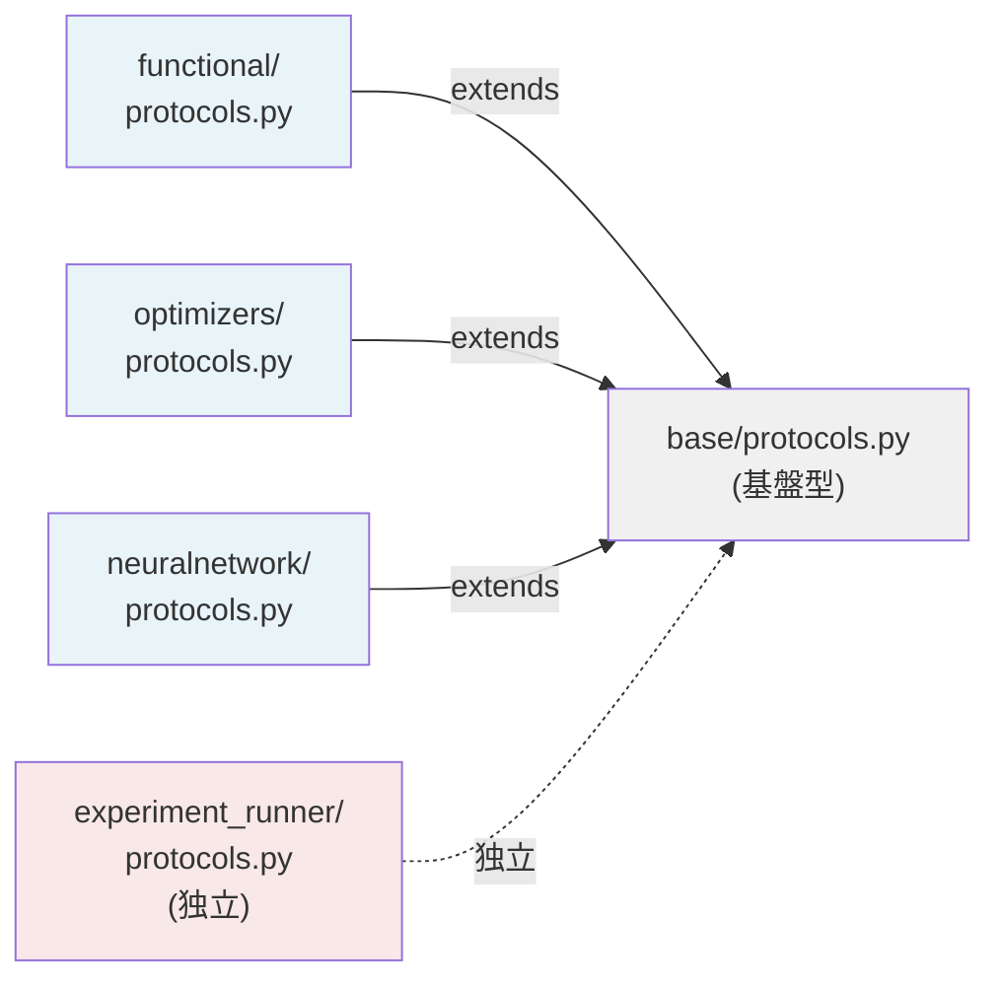

# Protocol 設計：型パラメータ化による抽象化戦略

このドキュメントは、プロジェクト全体の Protocol 構造と責務分離を図示します。

---

## 📋 概要

プロジェクトは **5つの Protocol レイヤ** で構成されます：

| レイヤ | ファイル | 責務 | 依存関係 |
|--------|---------|------|---------|
| **基盤** | `base/protocols.py` | 型定義・最適化問題の抽象 | なし |
| **関数型最適化** | `functional/protocols.py` | Function 型の最適化 | base |
| **ベクトル最適化** | `optimizers/protocols.py` | Vector 型の最適化 | base |
| **NN 最適化** | `neuralnetwork/protocols.py` | PyTree 型の最適化 | base |
| **実験実行** | `python/experiment_runner/protocols.py` | 実行制御・リソース管理 | 独立 |

---

## 🏛️ Layer 1: 基盤層 (`base/protocols.py`)

### 型エイリアス（すべてのレイヤが依存）

```python
# 基本型: 任意の Array 形状を許可
Scalar: TypeAlias = Float[Array, ""]      # スカラー値
Vector: TypeAlias = Float[Array, "n"]     # n次元ベクトル
Matrix: TypeAlias = Float[Array, "m n"]   # m×n行列
Operator: TypeAlias = Callable            # 線形・非線形演算子

# PyTree 構造化データ
PyTree[T]: TypeAlias = T | dict | list    # JAX PyTree フォーマット
```

### 抽象インターフェース

#### 最適化問題（基本形）

```python
class OptimizationProblem(Protocol[T]):
    """制約なし最適化問題の基本プロトコル。
    
    型パラメータ T（Variable type）で拡張可能：
    - T = Function   --> FunctionalOptimizationProblem
    - T = Vector     --> VectorOptimizationProblem
    - T = Params     --> PyTreeOptimizationProblem
    """
    
    def objective(self, x: T) -> Scalar:
        """目的関数 f(x) を計算。"""
        ...
    
    def gradient(self, x: T) -> T:
        """勾配 ∇f(x) を計算。"""
        ...
```

#### 制約付き最適化問題

```python
class ConstrainedOptimizationProblem(OptimizationProblem[T], Protocol[T]):
    """等式・不等式制約を伴う最適化問題。"""
    
    def constraint_eq(self, x: T) -> Vector:
        """等式制約 h(x) = 0。"""
        ...
    
    def constraint_ineq(self, x: T) -> Vector:
        """不等式制約 g(x) ≤ 0。"""
        ...
```

#### ソルバ状態（変分法の中間状態）

```python
class OptimizationState(Protocol):
    """ソルバーの状態（反復数、残差など）。
    
    各ソルバー実装が提供する状態オブジェクト：
    - PCGState, MINRESState (solvers)
    - GradientDescentState, AdamState (optimizers)
    """
    
    iteration: int
    residual: Scalar
    converged: bool
```

---

## 🔷 Layer 2: 関数型最適化 (`functional/protocols.py`)

### 拡張プロトコル

```python
class FunctionalOptimizationProblem(Protocol):
    """関数空間での最適化。
    
    変数 x が関数（Function）である問題。
    例: 変分法、関数解析ベース最適化。
    """
    
    def objective(self, f: Function) -> Scalar:
        """関数汎関数 J[f] → R。"""
        ...
    
    def functional_derivative(self, f: Function) -> Function:
        """関数微分 δJ/δf。"""
        ...
```

### 責務

- **Smolyak 積分**: 関数空間의 求積
- **Monte Carlo**: 確率的サンプリング
- **Protocol インターフェース**: 柔軟な関数表現

---

## ⬇️ Layer 3: ベクトル最適化 (`optimizers/protocols.py`)

### 拡張プロトコル

```python
class VectorOptimizationProblem(Protocol):
    """ベクトル空間での最適化。
    
    変数 x ∈ ℝⁿ の最適化。
    最も一般的で広く使われる領域。
    """
    
    def objective(self, x: Vector) -> Scalar:
        """目的関数 f: ℝⁿ → ℝ。"""
        ...
    
    def gradient(self, x: Vector) -> Vector:
        """勾配 ∇f: ℝⁿ → ℝⁿ。"""
        ...
    
    def hessian(self, x: Vector) -> Matrix:
        """ヘッセ行列 ∇²f: ℝⁿ → ℝⁿ×ⁿ。"""
        ...
```

### 責務

- **勾配法**: GD, SGD, Adam など
- **二階法**: Newton, BFGS オプティマイザ
- **制約付き**: KKT ソルバー統合

---

## 🧠 Layer 4: NN 最適化 (`neuralnetwork/protocols.py`)

### 拡張プロトコル

```python
class NeuralNetworkProblem(Protocol):
    """PyTree 構造化パラメータの最適化。
    
    変数 θ が PyTree（ニューラルネットパラメータ）である問題。
    深層学習が典型的な応用。
    """
    
    def objective(self, params: Params) -> Scalar:
        """ロス関数 L(θ)。"""
        ...
    
    def gradient(self, params: Params) -> Params:
        """パラメータ勾配 ∂L/∂θ。"""
        ...
    
    def layer_wise_gradient(
        self, params: Params, layer_idx: int
    ) -> Params:
        """層別勾配（前進/逆伝播の制御）。"""
        ...
```

### 責務

- **層別訓練**: Forward/Backward の細粒度制御
- **PyTree 管理**: ニューラルネットの構造化
- **メモリ最適化**: Equinox 統合

---

## ⚡ Layer 5: 実験実行 (`python/experiment_runner/protocols.py`)

### 独立プロトコル（他に依存しない）

```python
class Scheduler[T](Protocol):
    """実験スケジューラー。
    
    T: スケジュール対象のタイプ（関数、パラメータなど）
    """
    
    def schedule(self, step: int) -> T:
        """各ステップでの値を返す。"""
        ...

class Worker[T, U](Protocol):
    """分散ワーカー。
    
    T: 入力タイプ, U: 出力タイプ
    """
    
    def execute(self, task: T) -> U:
        """タスクを実行。"""
        ...

class Runner[T, U](Protocol):
    """実験実行エンジン。
    
    T: 入力スペック, U: 結果フォーマット
    """
    
    def run(self, spec: T) -> U:
        """実験を実行・途中結果を保存。"""
        ...
```

### 責務

- **リソース推定**: 計算量・メモリ見積もり
- **分散実行**: マルチプロセス・フェデレーション
- **結果管理**: チェックポイント・復旧

---

## 🔗 依存グラフ



---

## 📐 型パラメータ化戦略（Design Pattern）

### Template Method パターン

すべての最適化モジュールが同じ基本テンプレートを使用：

```python
# base
class OptimizationProblem[T]:
    def objective(self, x: T) -> Scalar: ...
    def gradient(self, x: T) -> T: ...

# functional (特殊化: T = Function)
FunctionalOptimizationProblem:
    def objective(self, f: Function) -> Scalar: ...
    def functional_derivative(self, f: Function) -> Function: ...

# optimizers (特殊化: T = Vector)
VectorOptimizationProblem:
    def objective(self, x: Vector) -> Scalar: ...
    def hessian(self, x: Vector) -> Matrix: ...

# neuralnetwork (特殊化: T = Params)
NeuralNetworkProblem:
    def objective(self, θ: Params) -> Scalar: ...
    def layer_wise_gradient(self, θ: Params, i: int) -> Params: ...
```

### 利点

✅ **再利用性**: 新しい型 T を追加するだけで拡張可能  
✅ **型安全**: Protocol ベースで型チェッカー統合  
✅ **責務明確**: 各レイヤが関心事のみ担当

---

## 📋 ファイル別チェックリスト

### ✅ base/protocols.py

- [x] Scalar, Vector, Matrix 型定義
- [x] OptimizationProblem[T] 基本 Protocol
- [x] ConstrainedOptimizationProblem
- [x] OptimizationState
- [ ] Module docstring（未実装）

### ✅ functional/protocols.py

- [x] FunctionalOptimizationProblem
- [x] Function 型ユーティリティ
- [ ] クラス docstring ✅（7個）
- [ ] Module docstring（未実装）

### ✅ optimizers/protocols.py

- [x] VectorOptimizationProblem
- [x] ヘッセ行列対応
- [ ] Module docstring（未実装）

### 🟡 neuralnetwork/protocols.py

- [x] NeuralNetworkProblem
- [x] Params, Static 型定義
- [ ] 層別訓練 protocol（検討中）
- [ ] Module docstring（未実装）

### 🟡 experiment_runner/protocols.py

- [x] Scheduler[T]
- [x] Worker[T, U]
- [x] Runner[T, U]
- [x] リソース推定インターフェース
- [x] Module docstring ✅
- [x] クラス docstring ✅

---

## ⚙️ 実装上の注意

### Protocol 継承（厳禁）

❌ **avoid**: `class MyProblem(OptimizationProblem): ...`

Protocol は **構造的サブタイプ** であり、明示的継承は意図と異なります。

✅ **prefer**: `@runtime_checkable` + `isinstance()` 検証

```python
from typing import Protocol, runtime_checkable

@runtime_checkable
class OptimizationProblem(Protocol[T]):
    def objective(self, x: T) -> Scalar: ...

# 使用
if isinstance(my_problem, OptimizationProblem):
    ...
```

### 型パラメータ標準化

すべての最適化 Protocol で **同じ型署名** を使用：

```python
def solve(
    problem: OptimizationProblem[T],  # T: Function/Vector/Params
    x0: T,
    ...
) -> tuple[T, int, dict]:
    """解を返す。"""
```

これにより、**ジェネリック ソルバー** の実装が可能です。

---

## 📚 参考資料

- [PEP 544 — Protocols](https://peps.python.org/pep-0544/)
- [Typing.Protocol Documentation](https://docs.python.org/3/library/typing.html#typing.Protocol)
- [Design Patterns in Python](https://refactoring.guru/design-patterns/python)
