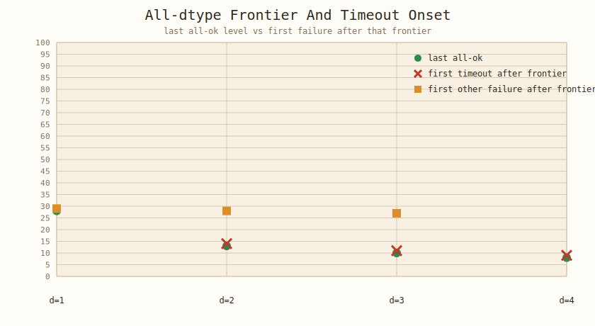
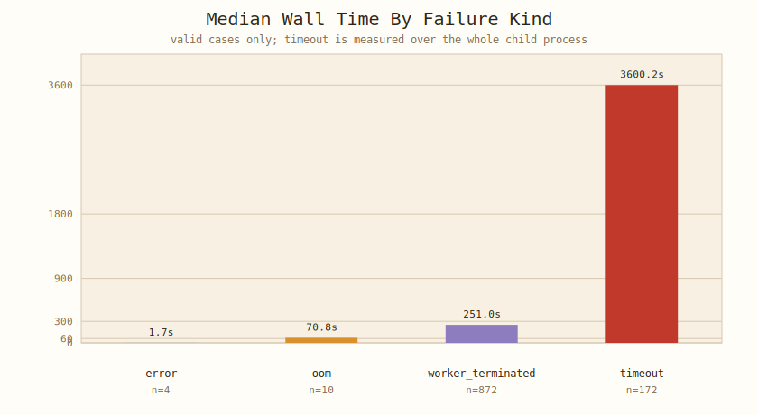
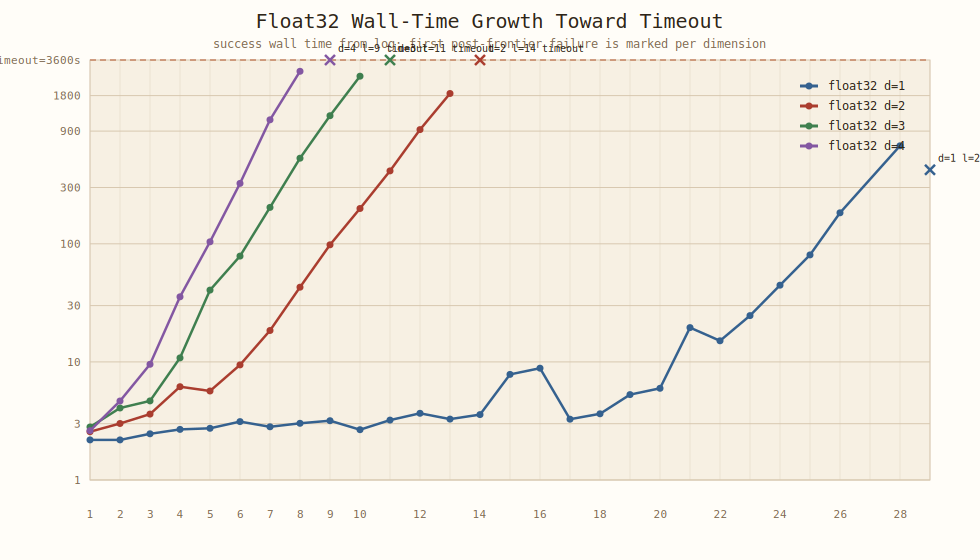
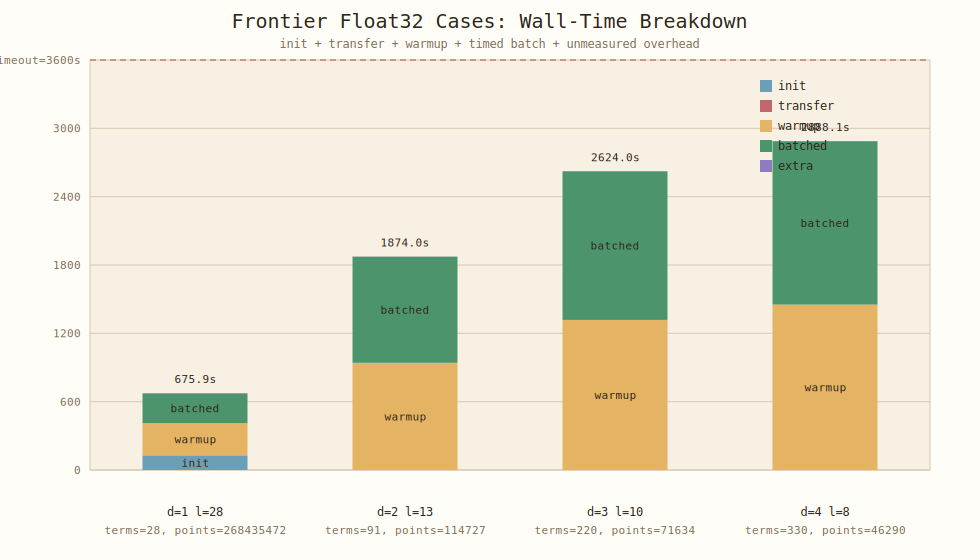

# Tuned Smolyak Timing And Timeout Report 2026-03-18

## 0. 目的

このメモは、

継続中の tuned Smolyak 実験について、

特に

- 1 ケース起動時の時間コスト
- 計算時間の伸び方
- timeout が発生する理由
- 現状コードから見える構造的な原因

を整理するための報告書である。

計測は live run を止めず、

`2026-03-18T08:05:42Z` 時点で生成した timing report を基準にしている。

## 1. 生成物

- timing report summary
  - [`summary.json`](../../experiments/functional/smolyak_scaling/results/smolyak_scaling_gpu_20260316T134600Z_timing_report_20260318T080542Z/summary.json)
- Figure 1: frontier levels
  - [`frontier_levels.svg`](../../experiments/functional/smolyak_scaling/results/smolyak_scaling_gpu_20260316T134600Z_timing_report_20260318T080542Z/frontier_levels.svg)
- Figure 2: failure wall time by kind
  - [`failure_wall_by_kind.svg`](../../experiments/functional/smolyak_scaling/results/smolyak_scaling_gpu_20260316T134600Z_timing_report_20260318T080542Z/failure_wall_by_kind.svg)
- Figure 3: float32 wall-time growth
  - [`float32_wall_growth.svg`](../../experiments/functional/smolyak_scaling/results/smolyak_scaling_gpu_20260316T134600Z_timing_report_20260318T080542Z/float32_wall_growth.svg)
- Figure 4: frontier float32 wall breakdown
  - [`frontier_breakdown_float32.svg`](../../experiments/functional/smolyak_scaling/results/smolyak_scaling_gpu_20260316T134600Z_timing_report_20260318T080542Z/frontier_breakdown_float32.svg)
- source JSONL
  - [`smolyak_scaling_gpu_20260316T134600Z.jsonl`](../../experiments/functional/smolyak_scaling/results/smolyak_scaling_gpu_20260316T134600Z.jsonl)
- source log
  - [`run_smolyak_scaling_20260316T134600Z.log`](../../experiments/functional/smolyak_scaling/results/run_smolyak_scaling_20260316T134600Z.log)

## 2. エグゼクティブサマリー

- snapshot 時点の完了件数は `1704`、有効ケースは `1284`、有効ケース内の failure は `timeout=172`, `worker_terminated=872`, `oom=10`, `error=4` である。
- scheduler の timeout は「timed 部分」ではなく「子プロセス全体の wall time」にかかる。
- 現行コードでは、各ケースで
  1. CPU 上で積分器を初期化し、
  1. GPU へ転送し、
  1. 精度確認用の batched integral を回し、
  1. warmup として `num_repeats=100` の repeated integral を 1 回回し、
  1. さらに timed 用に同じ `num_repeats=100` をもう 1 回回す。
- したがって timeout 予算 `3600s` は、実質的には「100 回反復の timed batch 1 回分」ではなく、「その前にもう 1 回ほぼ同じ batch を払った後の残り予算」である。
- 実測でも frontier 近傍では `warmup_seconds` と `batched_integral_seconds` がほぼ同じで、`dimension>=2` では startup 側が総時間の約半分を占める。
- 一方、プロセス生成やログ書き込みなど、内部計測外の追加オーバーヘッドは成功ケース median で `1.85s` しかない。問題は spawn 自体ではなく、timed 区間の前に重い処理を入れている点にある。
- `dimension=1` は timeout ではなく host memory pressure 由来の `worker_terminated` が支配的で、`dimension>=2` は典型的な時間壁である。

## 3. 時間モデル

コード上の時間分解は

$$
T_{\mathrm{case}}
=
T_{\mathrm{spawn}}
+
T_{\mathrm{init}}
+
T_{\mathrm{transfer}}
+
T_{\mathrm{warmup}}
+
T_{\mathrm{timed}}
+
T_{\mathrm{write}}.
$$

ここで実装上の対応は

$$
T_{\mathrm{init}} = t_1 - t_0,
\quad
T_{\mathrm{transfer}} = t_2 - t_1,
\quad
T_{\mathrm{warmup}} = t_3 - t_2,
\quad
T_{\mathrm{timed}} = t_4 - t_3.
$$

さらに

$$
T_{\mathrm{timed}} = R \cdot \bar t(d, \ell), \qquad R = 100
$$

であり、

`warmup_seconds` には

- `num_accuracy_problems = 9` 本の accuracy evaluation
- JIT warmup
- `R=100` 回の repeated integral 1 本分

が入る。

したがって実ケース時間は概ね

$$
T_{\mathrm{case}}
\approx
T_{\mathrm{spawn}}
+
T_{\mathrm{init}}
+
T_{\mathrm{transfer}}
+
T_{\mathrm{accuracy}}(K)
+
T_{\mathrm{compile}}
+
2R\,\bar t(d,\ell)
+
T_{\mathrm{write}},
\qquad K=9.
$$

timeout 条件は

$$
T_{\mathrm{case}} > \tau,
\qquad \tau = 3600\,\mathrm{s}
$$

である。

Interpretation:

現在の benchmark は、

`avg_integral_seconds` の測定そのものより前に

かなり大きな前処理コストを抱えている。

## 4. 定量観測

### 4.1 frontier と failure onset

有効な all-dtype frontier は次の通りである。

| dimension | last all-ok level | first timeout after frontier | first other failure after frontier |
| --------- | ----------------: | ---------------------------: | ---------------------------------: |
| 1         |                28 |                            - |                                 29 |
| 2         |                13 |                           14 |                                 28 |
| 3         |                10 |                           11 |                                 27 |
| 4         |                 8 |                            9 |                                  - |

Interpretation:

- `dimension=2,3,4` では frontier の直後に timeout が始まる。
- `dimension=1` だけは様子が違い、timeout より先に resource kill が出る。
- `dimension=1` は level 23-27 でも OOM が混ざるが、level 28 で全 dtype success が一度戻っている。したがってここは純粋な数式的限界ではなく、実行時資源圧迫と並列実行条件に敏感な領域である。

### 4.2 failure ごとの実 wall time

valid case の log wall time median は次の通りである。

| failure kind        | count | median wall [s] |
| ------------------- | ----: | --------------: |
| `error`             |     4 |          `1.71` |
| `oom`               |    10 |         `70.78` |
| `worker_terminated` |   872 |        `250.99` |
| `timeout`           |   172 |       `3600.15` |

Interpretation:

- `timeout` は scheduler が wall clock `3600s` で切っていることと一致する。
- `worker_terminated` はそれよりかなり早い時点で終わっており、algorithmic timeout ではなく external kill / OOM の色が強い。
- `error` は即死に近く、主要問題ではない。

### 4.3 float32 の wall-time growth

float32 の代表的な成功系列では、成功 wall time は次のように伸びる。

- `d=2`: `l=10 -> 196.7s`, `l=11 -> 412.2s`, `l=12 -> 925.5s`, `l=13 -> 1874.0s`, `l=14 -> timeout`
- `d=3`: `l=7 -> 201.4s`, `l=8 -> 529.4s`, `l=9 -> 1213.9s`, `l=10 -> 2624.0s`, `l=11 -> timeout`
- `d=4`: `l=5 -> 102.1s`, `l=6 -> 322.5s`, `l=7 -> 1119.7s`, `l=8 -> 2888.1s`, `l=9 -> timeout`

Interpretation:

frontier 近傍では level を 1 上げるごとの wall time 増加率が概ね `2x` から `3x` に達している。

そのため、

- `d=2, l=13`
- `d=3, l=10`
- `d=4, l=8`

がすでに timeout のかなり近くにあり、

次の level が落ちるのは自然である。

### 4.4 frontier 成功ケースの時間分解

float32 の frontier 成功ケースを分解すると次の通りである。

| case        | wall [s] | init [s] | transfer [s] | warmup [s] | timed batch [s] | extra [s] | startup share |
| ----------- | -------: | -------: | -----------: | ---------: | --------------: | --------: | ------------: |
| `d=1, l=28` |  `675.9` | `128.38` |       `0.71` |   `282.73` |        `260.01` |    `4.06` |       `61.3%` |
| `d=2, l=13` | `1874.0` |  `0.019` |      `0.023` |   `941.25` |        `931.25` |    `1.45` |       `50.3%` |
| `d=3, l=10` | `2624.0` |  `0.026` |      `0.024` |  `1317.64` |       `1304.87` |    `1.40` |       `50.2%` |
| `d=4, l=8`  | `2888.1` |  `0.025` |      `0.032` |  `1451.94` |       `1434.65` |    `1.44` |       `50.3%` |

Interpretation:

- `dimension>=2` では `init` と `transfer` はほぼ無視できる。
- それでも startup share が約 `50%` に達するのは、`warmup_seconds` が実質的に timed batch と同じ重さだからである。
- つまり timeout 予算の半分近くが、測定前の warmup ですでに消えている。
- `dimension=1, level=28` だけは `init` が `128s` あり、ここでは CPU 初期化そのものが重い。

### 4.5 内部計測外の追加オーバーヘッド

成功ケースについて、

$$
T_{\mathrm{extra}} = T_{\mathrm{wall}} - (T_{\mathrm{init}} + T_{\mathrm{transfer}} + T_{\mathrm{warmup}} + T_{\mathrm{timed}})
$$

を取ると、median は `1.85s` である。

Interpretation:

`subprocess.Popen`、Python import、JSONL append + `fsync`、scheduler poll などは無視できるとは言わないが、timeout の主因ではない。

主因は、内部計測に入っている処理そのものが重いことだ。

## 5. 静的解析

### 5.1 timeout は子プロセス全体にかかっている

`python/jax_util/experiment_runner/subprocess_scheduler.py:213-277` では、

子プロセス起動直後から `started_at` を取り、

`timeout_seconds` を超えたらその子を terminate / kill して `failure_kind="timeout"` を付けている。

Interpretation:

timeout は

- integrator 初期化
- GPU 転送
- accuracy evaluation
- warmup
- timed batch
- JSONL 書き込み待ち

を全部含んだ wall clock 制限である。

### 5.2 1 ケースごとに CPU 初期化からやり直している

`experiments/functional/smolyak_scaling/run_smolyak_scaling.py:344-371` では、

毎ケース

1. `initialize_smolyak_integrator(...)` を CPU 上で構築し、
1. `jax.device_put(...)` で target device へ転送している。

Interpretation:

prepared plan や rule storage の再利用は case 間で行っていない。

### 5.3 warmup の中身が重い

`experiments/functional/smolyak_scaling/run_smolyak_scaling.py:376-403` では、

`warmup_seconds` に入る区間で

- `batched_accuracy_integrals(integrator, accuracy_coeffs)`
- `repeated_integral(integrator, coeffs)`

を実行し、

その後でさらに同じ `repeated_integral(integrator, coeffs)` を timed 用にもう一度呼んでいる。

Interpretation:

現在の benchmark は

「warmup が軽い前処理」ではなく、

実測 batch にかなり近い本計算を 1 回余分に払っている。

これは timeout frontier を強く押し下げる。

### 5.4 case ごとの JIT 再利用が効きにくい

`repeated_integral` は `_run_single_case` 内で `@eqx.filter_jit` 付きで定義されている。

また scheduler は 1 ケースごとに fresh subprocess を起動する。

Interpretation:

in-memory の JIT キャッシュは child process 間で使い回せない。

さらに integrator の shape は `dimension` と `level` で変わるため、

case ごとの specialization が残りやすい。

ここはコード構造からの推論だが、

少なくとも「1 child が 1 case だけ処理して終了する」設計は、

compile amortization に不利である。

### 5.5 `dimension=1` の起動コストが重い理由

`python/jax_util/functional/smolyak.py:241-297` の `_difference_rule_storage_numpy` と `_initialize_rule_storage` は、

max level までの 1D difference rule を host NumPy 配列として全部作り、

`nodes_by_level` / `weights_by_level` を list に保持したうえで、

最後に flat storage へもう一度詰め直している。

さらに `python/jax_util/functional/smolyak.py:300-333` では term plan も host 上で構築する。

Interpretation:

`dimension=1, level=28` で `num_points=268435472` に達するケースでは、

最終 storage だけでなく、

初期化途中の host-side temporary もかなり大きくなる。

結果として、

- `integrator_init_seconds` が `128s` 級まで伸び、
- `process_rss_mb` が `24.6 GB` 級になり、
- `worker_terminated` が timeout より前に出る

という振る舞いと整合する。

### 5.6 高次元側の timeout 理由

`python/jax_util/functional/smolyak.py:381-506` の積分器本体は、

- term ごとに `fori_loop`
- 軸ごとに再帰
- chunking は最後の 1 軸だけ

という構造になっている。

また term 数は

$$
N_{\mathrm{terms}}(d, \ell) = \binom{d + \ell - 1}{d}
$$

で増える。

frontier 近傍の代表値は

- `d=2, l=13`: `91` terms
- `d=3, l=10`: `220` terms
- `d=4, l=8`: `330` terms

であり、timeout onset の次レベルでは

- `d=2, l=14`: `105` terms
- `d=3, l=11`: `286` terms
- `d=4, l=9`: `495` terms

に跳ねる。

Interpretation:

高次元側では、

単に `num_points` が増えるだけでなく、

term 数と prefix recursion の増加が効いている。

`d=4, l=8` は `num_points=46290` しかないのに `wall=2888s` まで伸びており、

「点数だけ見ればまだ軽いはず」という直感は通用しない。

## 6. timeout 課題の整理

### 6.1 いま最も大きい課題

Consideration:

timeout 課題の中心は、

「timed batch 自体が遅い」ことに加えて、

その直前にほぼ同じ重さの warmup をもう一度実行していることだ。

`dimension=4, level=8, float32` では

- `warmup_seconds = 1451.94`
- `batched_integral_seconds = 1434.65`

であり、

この 2 つだけで `2886.59s` を占める。

timeout は `3600s` なので、

残り余白は `700s` しかない。

次の `level=9` が timeout するのは自然である。

### 6.2 起動時間の意味を分けるべき

Consideration:

「起動が遅い」というとき、

現状コードでは少なくとも 3 つの成分が混ざっている。

1. subprocess / import / I/O の固定費
1. integrator 初期化と device transfer
1. accuracy evaluation と warmup repeated batch

このうち支配的なのは 3 であり、

1 は小さい。

`dimension=1` の高 level に限っては 2 も大きい。

## 7. 次に試すべき改善

Idea:

timeout frontier を広げたいなら、最初に疑うべきは dtype ではなく benchmark 手順である。

1. frontier 探索用 run では `num_repeats` を大きく下げる
1. warmup repeated batch を 100 回から 1 回ないし数回へ落とす
1. accuracy evaluation と timing run を分離する
1. timeout を child whole-wall ではなく phase-aware に観測する

Idea:

構造改善としては次が優先候補である。

1. rule storage と prepared plan の再利用
1. child process の使い捨てをやめる、または同形状ケースをまとめる
1. `_difference_rule_storage_numpy` の一時配列重複を減らす
1. 最後の軸以外にも chunking / batching を入れる

Consideration:

少なくとも現在のデータからは、

`float32` は `float64` とほぼ同じ精度域に入りつつ時間差も小さいので、

dtype 変更だけで timeout を解消する見込みは薄い。

主因は benchmark 手順と積分器構造にある。
