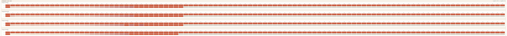
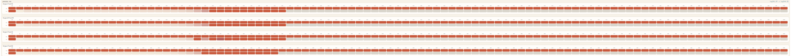
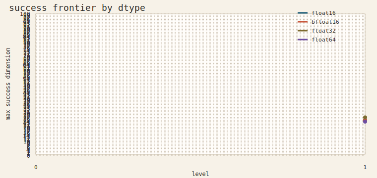
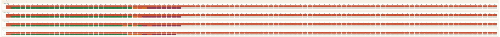

# Smolyak 積分器

## このページの役割

このページは、Smolyak 積分器について今わかっていることを、外から読んでも分かる形でまとめたページです。

ここでは、内部の branch 名や作業履歴ではなく、手法そのものを主語にします。

## いま一番大事な結論

Smolyak 積分器の問題は 1 つではありません。

`点を全部作ってから積分する方法` では、host 側のメモリと初期化が先に限界に来ます。

`点を全部は作らず、plan を先に作って評価する方法` では、点群の保持は軽くなりますが、今度は初期化、lowering、compile の重さが前に出ます。

つまり、ボトルネックは消えたのではなく、場所が変わっています。

この状況は、概念的には

$$
T_{\mathrm{total}}
=
T_{\mathrm{init}}
- T_{\mathrm{transfer}}
- T_{\mathrm{integral}}
$$

と書けます。

今の観測では、問題になっているのは主に $T_{\mathrm{init}}$ です。

## 代表図

### 初期化時間

次元が上がると、積分本体より先に初期化時間が急増します。

この図で重要なのは、まだ `level=1` の段階でも重くなっていることです。

### メモリ使用量

同じ partial では、process RSS も次元とともに急増します。

このため、現段階では GPU の積分 kernel より、初期化と保持の経路を見るほうが重要です。

### 実行可能領域

途中結果の frontier からも、限界がまず実装側にあることが分かります。

この図は、数値精度の限界というより、現実にどこまで run が進んだかを示しています。

## 定量スナップショット

途中結果の `level=1` だけを見ても、かなりはっきりした傾向があります。

- `float16`
  - 成功最大次元 `25`
  - 最初の失敗次元 `26`
- `bfloat16`
  - 成功最大次元 `25`
  - 最初の失敗次元 `26`
- `float32`
  - 成功最大次元 `27`
  - ただし `24` で先に失敗があり、単調ではない
- `float64`
  - 成功最大次元 `24`
  - 最初の失敗次元 `25`

この並びから重要なのは、`float32` が単純に最良という話ではないことです。

失敗位置が単調でないので、ここで見えている frontier は純粋な数値精度限界ではありません。

今は、メモリ、初期化、child の終了状態を含んだ `実行可能性の frontier` を見ています。

## うまくいかなかった方法

### 点群を全部作る方法

この方法では、各 term の tensor-product points を host 上で作り、それらをまとめて重複統合します。

この構造は分かりやすいですが、メモリに厳しいです。

特に重かったのは、点配列そのものだけではありません。重み配列、各 term の一時配列、`np.unique(axis=0)` に必要な補助配列も同時に大きくなります。

その結果、GPU 計算に入る前に host 側で時間とメモリを使い切りやすくなります。

この方法で見えた教訓ははっきりしています。Smolyak 積分では、`積分点数` だけでなく、`点の保持方法` そのものが支配的な要因になります。

Source:
この節の「Smolyak 近似を多重添字の和として書く」部分は Holtz の sparse grid quadrature の説明に対応します。[Holtz 2010, p. 58, Eq. (4.5)](/workspace/references/978-3-642-16004-2.pdf)

Source:
`点の保持方法が重要になる`、`hash table` や `tree` が sparse grid storage の典型である、という点は Murarasu の整理に対応します。[Murarasu 2013, p. 20](/workspace/references/sparse_grid/Murarasu_2013_PhD_Advanced_Optimization_Techniques_for_Sparse_Grids_on_Modern_Heterogeneous_Systems.pdf) [Murarasu 2013, p. 43](/workspace/references/sparse_grid/Murarasu_2013_PhD_Advanced_Optimization_Techniques_for_Sparse_Grids_on_Modern_Heterogeneous_Systems.pdf)

## 改善した点

### 公開 API を単純にしたこと

公開 API を `integrate(f, integrator)` にそろえたのは良い変更でした。

これで、積分器の役割がはっきりしました。

外から見ると必要なのは「積分する」ことだけです。点群を外へ返す必要はありません。

この整理により、内部では点群よりも rule table や term plan を中心に持てるようになりました。

### 実験 runner を分けたこと

実験 runner を共通サブモジュールに切り出したのも有効でした。

これにより、JSONL の逐次保存、child の完了通知、GPU slot の管理を実験ごとに書き直さずに済むようになりました。

長時間実験では、実装の速さだけでなく、途中停止しても結果を回収できることが重要です。

Observation:
この節はこの project の実験運用から得た観測です。文献からの直接の要約ではありません。

## まだ重い方法

### plan を先に作って再帰的に評価する方法

この方法は、点群を全部作る方法よりは筋が良いです。

しかし、現時点ではまだ十分軽いとは言えません。

観測では、`level=1` で `num_points=1` のケースでも、次元が増えると `integrator_init_seconds` と `process_rss_mb` が急増しました。

これは大事な点です。

もし本当に重いのが積分点数なら、`num_points=1` ではここまで苦しくならないはずです。

したがって、今の主問題は積分本体ではなく、初期化、lowering、compile、あるいはその前段の metadata 構築にあると見るのが自然です。

Observation:
この節は partial JSON と HLO 解析からの観測です。特に `num_points=1` でも初期化時間が急増する、という判断は project 内の実験結果に基づいています。

Observation:
`level=1` の成功末尾では、`float16 d=25` が `16.32s / 3659.8 MB`、`bfloat16 d=25` が `14.49s / 3612.6 MB`、`float32 d=27` が `54.91s / 12646.4 MB`、`float64 d=24` が `6.99s / 2080.5 MB` でした。ここでの並びは、単なる dtype 順位というより、初期化経路と実行基盤の不安定性を含んだ結果です。

## HLO から見えること

HLO 解析でも同じ方向の結果が出ています。

小さいケースでも目立つのは、重い算術演算ではなく、

- `while`
- `call`
- `gather`

です。

これは、今の実装が `大きな線形代数を GPU にまとめて投げる形` ではなく、`制御フローと index 処理が目立つ形` であることを示しています。

つまり、点群を作らなくなっただけでは、GPU が自動的に主役になるわけではありません。

この点は、次のように見れば整理しやすいです。

$$
\text{heavy arithmetic}
\neq
\text{heavy implementation}
$$

今の実装では、重いのは大きな行列演算というより、制御フローと index 処理です。

Observation:
この節は project 内の HLO dump の読みです。`while`、`call`、`gather` が目立つという主張は、実験で得た HLO JSONL に基づいています。

## 数値精度について

数値精度の問題と、実装コストの問題は分けて考える必要があります。

低精度では、Smolyak の重み付き和で相殺誤差が出やすいです。

たとえば逐次加算の誤差は概念的には

$$
|\hat s_n - s_n|
\lesssim
\gamma_{n-1}\sum_{k=1}^n |a_k|,
\qquad
\gamma_m=\frac{mu}{1-mu}
$$

の形で増えます。

Smolyak では正負の寄与が混ざりやすいので、真の和が小さいのに $\sum |a_k|$ は大きい、という状況が起きます。

この条件では、低精度が不利になるのは自然です。

Source:
低精度で相殺誤差が出やすいという一般論は数値線形代数の標準的な見方に従っています。ここでの式は逐次加算誤差の教科書的な書き方であり、Smolyak 固有の公式ではありません。

ただし、今の大規模実験では、数値精度を十分比べる前に初期化コストが限界になっています。

したがって、現段階で見えている frontier は、精度の限界というより実装の限界を多く含んでいます。

## 実験コードで効いた工夫

### JSONL を逐次保存する

これは必須でした。

最終 JSON だけに頼ると、途中停止した run から何も読めません。

JSONL があれば、partial をあとから集計し直せます。

### child が明示的に完了を返す

child が `完了した` ことを host に明示的に返す設計は分かりやすいです。

これにより、`timeout`、`worker_terminated`、`oom` を分けて扱いやすくなりました。

### ケース順を設計する

ケース順は細部ではありません。

長時間実験では、途中で止まっても何が読めるかを決める要素です。

`dimension -> level -> dtype` の順は、次元ごとの frontier を早く読みたいときに向いています。

一方、`dtype -> level -> dimension` の順では、途中停止したときに先頭の dtype だけが進みやすく、比較しにくくなります。

Observation:
この節は project 内の長時間実験の運用から得た知見です。文献由来ではありません。

## 誤解しやすい点

### GPU が遊んで見える = GPU 割り当てバグ、ではない

これは今回とても大事だった点です。

GPU 1,2 がほとんど使われていないように見えても、実際には child ごとの GPU 可視性分離は成立していました。

問題は、GPU の割り当てではなく、CPU 側初期化が長く、GPU の実行時間が短く見えにくいことでした。

観測上の症状と原因を直接結び付けないことが重要です。

失敗の種類をまとめた図も、この読み方を助けます。

ここでは、`oom` や `worker_terminated` が前に出ています。したがって、まず疑うべきは数値近似そのものより実行基盤です。

Observation:
この節は project 内の multi-GPU 実験と `debug_gpu_visibility.py` の切り分けに基づく判断です。

## まだ分かっていないこと

まだ分かっていないのは、初期化コストの内訳です。

今は `integrator_init_seconds` という大きな塊で見えているだけです。

この中にどれだけ

- rule 準備
- tracing
- lowering
- compilation
- device 初期化

が含まれているかは、まだ十分には分かっていません。

また、高い level での dtype 差も、今は初期化コストに隠れていて、まだきれいには読めていません。

## まだ言えないこと

今のデータだけでは、次のことはまだ断定できません。

- どの dtype が高 level で最も安定か
- 高 level で誤差がどう改善するか
- plan ベースの方法が最終的に explicit-grid より常に有利か

理由は単純です。

その議論に入る前に、初期化コストと実行基盤の限界が前に出ているからです。

この順序を間違えると、実装限界を数値解析の限界だと誤読します。

## 実務上の指針

Smolyak 積分器を改善するときは、次の 2 つを分けて議論したほうがよいです。

1. 数値精度の問題
1. 保持戦略と初期化経路の問題

前者は重み付き和の安定性の話です。

後者は、点群をどう持つか、plan をどう作るか、compile がどこで重くなるかの話です。

この 2 つを混ぜると、何を直せばよいかが見えにくくなります。

## 文献との対応

ここで述べた内容のうち、`点群の保持方法が支配的になりうる`、`combination technique や sparse grid の保持戦略が重要である`、`適応的な index set の考え方が有効である` といった部分は、既知の sparse grid 文献とも整合します。

特に、Smolyak 近似の一般論と sparse grid の背景は Holtz の本がまとまっています。保持戦略や heterogeneous system 上での実装上の論点は Murarasu の thesis が参考になります。combination technique の誤差解析には Lastdrager-Koren が役に立ちます。適応的な quadrature と index set の扱いには Jakeman-Roberts や Hegland がつながります。

Source:
Smolyak と sparse grid quadrature の全体像は [Holtz 2010, Chapter 4](/workspace/references/978-3-642-16004-2.pdf)、dimension-adaptive の背景は [Holtz 2010, p. 12](/workspace/references/978-3-642-16004-2.pdf) に対応します。

Source:
storage と heterogeneous system 上の sparse grid 実装は [Murarasu 2013, p. 20, p. 43, p. 49](/workspace/references/sparse_grid/Murarasu_2013_PhD_Advanced_Optimization_Techniques_for_Sparse_Grids_on_Modern_Heterogeneous_Systems.pdf) に対応します。

Source:
combination technique の誤差解析は [Lastdrager-Koren 1998, p. 3-4](/workspace/references/sparse_grid/Lastdrager_Koren_1998_Error_analysis_for_function_representation_by_the_sparse_grid_combination_technique.pdf) に対応します。

Source:
adaptive quadrature と dimension adaptivity の説明は [Jakeman-Roberts 2011, p. 2-4](/workspace/references/sparse_grid/Jakeman_Roberts_2011_Local_and_Dimension_Adaptive_Sparse_Grid_Interpolation_and_Quadrature.pdf) と [Hegland 2003, p. 1-4](/workspace/references/sparse_grid/Hegland_2003_Adaptive_sparse_grids.pdf) に対応します。

## References

- [Smolyak Integrator Tuning Report](/workspace/notes/experiments/smolyak_integrator_report.md)
- [Smolyak partial results JSON archive](/workspace/notes/experiments/results/tuned_smolyak_partial_results_20260316.json)
- [Smolyak partial results note](/workspace/notes/experiments/tuned_smolyak_partial_results_20260316.md)
- [Path Resolution](/workspace/notes/knowledge/path_resolution.md)
- [Environment Setup](/workspace/notes/knowledge/environment_setup.md)
- [Experiment Operations](/workspace/notes/knowledge/experiment_operations.md)
- [Markus Holtz, Sparse Grid Quadrature in High Dimensions with Applications in Finance and Insurance, 2010](/workspace/references/978-3-642-16004-2.pdf)
- [Adina-Eliza Murarasu, Advanced Optimization Techniques for Sparse Grids on Modern Heterogeneous Systems, 2013](/workspace/references/sparse_grid/Murarasu_2013_PhD_Advanced_Optimization_Techniques_for_Sparse_Grids_on_Modern_Heterogeneous_Systems.pdf)
- [Fredrik N. Lastdrager and Barry Koren, Error analysis for function representation by the sparse grid combination technique, 1998](/workspace/references/sparse_grid/Lastdrager_Koren_1998_Error_analysis_for_function_representation_by_the_sparse_grid_combination_technique.pdf)
- [J. D. Jakeman and S. G. Roberts, Local and Dimension Adaptive Sparse Grid Interpolation and Quadrature, 2011](/workspace/references/sparse_grid/Jakeman_Roberts_2011_Local_and_Dimension_Adaptive_Sparse_Grid_Interpolation_and_Quadrature.pdf)
- [Mark Hegland, Adaptive sparse grids, 2003](/workspace/references/sparse_grid/Hegland_2003_Adaptive_sparse_grids.pdf)
